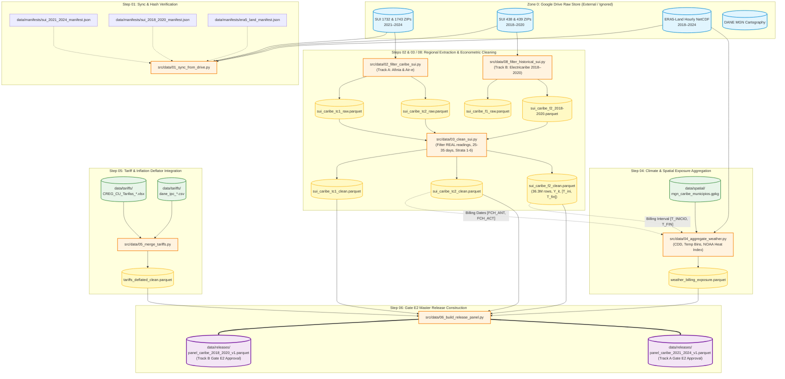

# Data Architecture & Storage Policy (Dual Regime: 2021–2024 & 2018–2020)

This document defines the scientific four-zone data management architecture for **Project E (`caribbean-climate-demand`)**, operating under a **dual parallel strategy**:
1. **Track A (CREG 015/2018 / 2021–2024):** Modern transaction microdata (TC1/1732 and TC2/1743) for Afinia and Air-e, actively pending complete national batches requested through a formal *Derecho de Petición* (SSPD).
2. **Track B (CREG 097/2008 / 2018–2020 & pre-2017 historical):** Integrated historical microdata (Formato 1/438 and Formato 2/439) for *Electricaribe*, immediately actionable with verified raw files.

---

## 1. Storage Tiering Overview

To maintain repository lightness, respect GitHub Git LFS team quotas (10 GB/month cap), and eliminate "two sources of truth" conflicts, data assets are strictly segregated across storage tiers:

| Zone | Directory / Target | Medium | Contents | Tracking Rule |
| :--- | :--- | :--- | :--- | :--- |
| **Zone 0: Raw Store** | **Google Drive** (`00_raw_sui/`, `01_raw_climate_era5/`, `02_raw_spatial_gis/`) | External Cloud Store | Heavy national SUI archives (1732/1743 and 438/439 ZIPs, ~41 GB), ERA5-Land NetCDF, raw DANE cartography. | **Not stored in Git repository**. Cataloged with SHA-256 in `data/manifests/`. Configured locally via `config/paths.local.toml`. |
| **Zone 1: Reference Data** | `data/tariffs/` & `data/spatial/` | **Git LFS** | Tariff resolutions (`CREG_CU_Tarifas_*.xlsx`), IPC deflators, and boundary GeoPackages (`mgn_caribe_municipios.gpkg`). | Tracked via `.gitattributes`. Versioned with code. |
| **Zone 2: Intermediate Data** | **Google Drive** (`03_intermediate/`) & `data/intermediate/` | External / Local Cache | Filtered Caribbean Parquet extracts: `sui_caribe_f1_raw.parquet`, `sui_caribe_f2_clean.parquet`, `sui_caribe_tc1_raw.parquet`, `weather_billing_exposure.parquet`. | **Ignored in Git (`.gitignore`)**. Shared centrally via Google Drive. |
| **Zone 2: Releases** | `data/releases/` | **Git LFS** | Immutable, checksummed estimation panels (`panel_caribe_2018_2020_v1.parquet` and `panel_caribe_2021_2024_v1.parquet`) approved for **Gate E2**. | Immutable after gate approval. Tracked via Git LFS. |
| **Governance & Metadata** | `manifests/`, `dictionaries/`, `schemas/` | Standard Git | JSON/YAML manifests (`sui_2021_2024_manifest.json`, `sui_2018_2020_manifest.json`), variable codebooks, validation schemas, attrition ledgers (`sui_caribe_f2_attrition.json`). | Plain text in Git. |

---

## 2. Zone 0: Google Drive Raw Store Architecture

All national microdata archives are stored in the centralized Google Drive directory (`Caribbean_Climate_Demand_Raw_Store/` or `caribbean-climate-demand-data/`):

```
📁 Caribbean_Climate_Demand_Raw_Store/                  <-- Carpeta raíz compartida en Google Drive
│
├── 📁 00_raw_sui/                                 <-- Almacén de microdatos nacionales crudos SSPD
│   ├── 📁 via_a_moderno_creg015/                  <-- Régimen 2021–2024 (TC1/1732 y TC2/1743)
│   │   ├── ENERGIA_1732_2023_1.zip
│   │   ├── ENERGIA_1743_2023_1.zip
│   │   └── ...
│   │
│   └── 📁 via_b_historico_creg097/                <-- Régimen 2018–2020 (Electricaribe)
│       ├── 📁 formato1_438/                       <-- 36 ZIPs de Usuarios y Conexión (2018–2020)
│       │   ├── Energia_438_M_1_2018.csv.zip
│       │   └── ...
│       └── 📁 formato2_439/                       <-- 36 ZIPs de Facturación Mensual
│           ├── 📁 2018/
│           ├── 📁 2019/
│           └── 📁 2020/
│
├── 📁 01_raw_climate_era5/                        <-- NetCDF horarios ERA5-Land (2018–2024)
│   ├── era5_land_hourly_2018.nc
│   └── ...
│
├── 📁 02_raw_spatial_gis/                         <-- Cartografía DANE MGN y capas UPME
│   ├── mgn_2023_nacional_raw.gpkg
│   └── upme_substations_raw.gpkg
│
└── 📁 03_intermediate/                            <-- Extractos Parquet filtrados y limpios
    ├── sui_caribe_f1_raw.parquet                  (~1.21 GB)
    ├── sui_caribe_f2_2018.parquet                 (~576 MB)
    ├── sui_caribe_f2_2019.parquet                 (~1.19 GB)
    ├── sui_caribe_f2_2020.parquet                 (~541 MB)
    ├── sui_caribe_f2_clean.parquet                (~1.68 GB - 36.3M obs)
    └── ...
```

---

## 3. Collaborator Setup Guide (`config/paths.local.toml`)

Because each researcher's workstation may mount Google Drive to a different path (e.g. `E:/My Drive/...`, `G:/Shared drives/...`, `/Users/.../Google Drive/...`), paths are never hardcoded in scripts.

### Step 1: Create your local configuration file
Copy the template [config/paths.example.toml](file:///d:/repos/master-tesis-economy/economics-research-program/caribbean-climate-demand/config/paths.example.toml) to `config/paths.local.toml` (this file is ignored by Git):
```bash
cp config/paths.example.toml config/paths.local.toml
```

### Step 2: Set your Google Drive local mount path
Edit `config/paths.local.toml` and configure `drive_root`:
* **Windows (Drive desktop app):** `drive_root = "E:/My Drive/Caribbean_Climate_Demand_Raw_Store"`
* **macOS:** `drive_root = "/Users/<username>/Google Drive/My Drive/Caribbean_Climate_Demand_Raw_Store"`
* **Linux:** `drive_root = "/home/<username>/gdrive/Caribbean_Climate_Demand_Raw_Store"`

### Step 3: Dynamic Path Resolution in Python
All processing scripts in `src/data/` dynamically resolve paths using [src/utils/paths.py](file:///d:/repos/master-tesis-economy/economics-research-program/caribbean-climate-demand/src/utils/paths.py), which checks:
1. Environment variables (`CARIBBEAN_DRIVE_ROOT`, `SUI_RAW_DIR`, `ERA5_RAW_DIR`, `GIS_RAW_DIR`).
2. Local user settings in `config/paths.local.toml`.
3. Default fallbacks in `config/paths.example.toml`.

---

## 4. Pipeline Execution Flow Diagram



---

## 5. Repository Data Directory Layout

```
data/
├── README.md                           # Master Data Architecture document (this file)
├── manifests/                          # [Git Standard] Source provenance, Drive IDs, SHA-256 checksums
│   ├── sui_2021_2024_manifest.json     # Track A CREG 015/2018 manifest
│   ├── sui_2018_2020_manifest.json     # Track B CREG 097/2008 manifest (72 archives)
│   └── era5_land_manifest.json         # ERA5-Land climate manifest
├── dictionaries/                       # [Git Standard] Variable definitions and codebooks
│   ├── sui_tc1_tc2_dictionary.md
│   ├── tariffs_dictionary.md
│   ├── weather_variables.md
│   └── SSPD_20212200012515_Anexos_TT2.pdf
├── schemas/                            # [Git Standard] Data validation schemas (Pydantic / JSONSchema)
│   ├── tc1_schema.json
│   └── tc2_schema.json
├── tariffs/                            # [Git LFS] CREG tariffs & DANE inflation deflators
│   ├── CREG_CU_Tarifas_2021_2024.xlsx
│   └── dane_ipc_2021_2024.csv
├── spatial/                            # [Git LFS] Geospatial boundary layers & UPME assets
│   ├── mgn_caribe_municipios.gpkg
│   └── upme/
├── intermediate/                       # [Google Drive / Ignored in Git] Cleaned intermediate Parquets
│   ├── README.md                       # Catalog of 10 intermediate Parquet products
│   └── sui_caribe_f2_attrition.json   # Sample retention audit ledger (66.22% retention)
└── releases/                           # [Git LFS] Approved Gate E2 estimation datasets
    ├── README.md                       # Sample balance, attrition log, checksums
    └── panel_caribe_2018_2020_v1.parquet (Final estimation panel)
```

---

## 6. Getting Started

1. **Install Git LFS:** Run `git lfs install` on your workstation.
2. **Configure Local Paths:** Copy `config/paths.example.toml` to `config/paths.local.toml` and set your local Google Drive directory.
3. **Inspect Manifests:** Run `python src/data/01_sync_from_drive.py` to verify hashes of raw data against manifest files.
